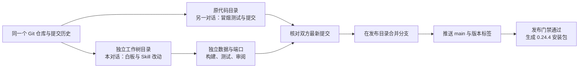

# Notara 🐾

欢迎来到 Notara 的小书桌。把题目、讲义，还有那句“这里我真的不懂”都放下来吧。小猫已经把笔记本摊好啦，我们从你会的那一步开始，一点点往前走。

Notara 用于围绕题目、讲义和学习问题展开讨论，并记录你的学习过程。你可以先写下自己的小尝试，再和教师一起把疑惑一点点拆开分析。

Notara 底层基于 **DeepSeek Harness**。保存的解题卡片、学生理解和课堂小结会乖乖留在本地的 Markdown 文件里，对话记录由本地运行时另行保存。下次回来，沿着计划、Vault 和技能页就能接着学啦。

当前版本为 **0.24.4**，依赖 **DSH 0.2.0-rc.1**。第一次来可以从安装开始；已经坐进教室的同学，直接跳到想用的功能就好。这份说明里的按钮名称都按当前版本写，免得你对着屏幕到处找，小耳朵都找耷拉了。

🐾 **0.24.4** 新增长对话预算保护、分层摘要与本课堂历史原文检索和分页回读，并修复 ChatGPT 重放与远控模型设置；浏览器标签页标题统一为 Notara「拾页」。数据格式保持 Version 5，兼容版本可通过「设置 → 更新」更新。0.24.3 的订阅动态模型目录、0.24.2 的白板编辑与更新恢复修复，以及 0.24.1 的自由白板和课堂分组继续保留。

长对话功能的真实教学边界和验证结果见[0.24.4 版本说明](docs/releases/native-vault-0.24.4.md)：官方 DeepSeek 12 轮合成课堂的结构与检索项通过，但完成状态第 5/12 轮仍失败；后续规则增强只通过确定性 smoke，尚未用真实模型复验其效果。

| 你现在想做什么 | 从这里出发 |
| --- | --- |
| 把 Notara 装好并打开 | [安装与启动](#install) · [首次模型配置](#first-start) |
| 创建自己的学习集 | [选择目录、填写梗概、启用学习集背景](#learning-set) |
| 问题、上课、保存进展 | [课堂与教学设置](#classroom) · [后台工作员](#workers) |
| 读讲义、圈 PDF、整理题卡 | [Vault 完整操作](#vault) · [白板与导出](#board) |
| 排课、复习、留下日记 | [路线、日历与复习](#plans) |
| 保存方法、调整老师的使用习惯 | [技能与全部内置教学技能](#skills) |
| 查公开资料、了解联网条件 | [联网检索与资料整理流程](#online-research) |
| 换外观、查用量、删除课堂 | [设置与课堂收纳](#settings) |
| 使用订阅账号或手机访问 | [ChatGPT 登录](#chatgpt) · [ngrok 远控](#remote) |
| 升级、排查问题、看每版变化 | [更新与备份](#updates) · [常见问题](#faq) · [倒序更新记录](#changelog) |
| 理解工作树与发布过程 | [工作树流程图](#worktrees) |

---

## 🌟 主要功能

**书院画廊开门啦。** 首页点「书院画廊」，会在新标签页展开九位角色的完整立绘设定图与文字档案；点图片还能单独放大看。现在先把她们的故事收进小展厅，后面再慢慢布置呀。应用图标换成书页 N，已有桌面快捷方式可运行 `create-notara-shortcuts.cmd` 刷新。完整设定收在 [角色文档](resources/academy/characters.md)，原始 PNG 放在 `resources/academy/originals/`。

- **带着自己的想法讨论**：混合教法让教师从你卡壳的地方切入，按实际理解情况调整讲法。教师还可以按需召唤题目研究员、课时备课员、核验员、通用工作员和出题员来协同协助。
- **把学习过程留下来**：题卡会同时收纳题面、参考理解与你的作答思路，课堂小结连接前后进展。讲义和卡片都以本地文件保存，随时可在 Vault 中翻看、修改、检索与建立关联。
- **沿着计划稳稳前行**：用路线组织课程，在日历上安排节奏。复习依据实际检验过的关键一步记录；档位会决定下次复习间隔，不代表已经全面掌握知识。
- **在白板上并肩梳理**：课堂支持在对话、双面白板与教室之间切换；像素教室是可选插件。白板支持公式、图形和作答，卡片长宽与布局可保存；超宽的独立公式支持横向滚动。
- **沉淀专属学习方法**：在技能页管理学习集与学科技能，教师提出的修订建议，由你自主决定采用还是丢弃。界面提供极简风与手帐风两种视觉，并遵循深浅色设置。

<a id="install"></a>

## 🚀 安装与启动

Windows 入口文件统一使用英文名，方便在不同语言的系统上使用喵：

| 文件 | 用途 |
| --- | --- |
| `install-notara.cmd` | 安装普通压缩包；免安装包不需要、也不包含此入口 |
| `start-notara.cmd` | 启动 Notara 并打开浏览器 |
| `stop-notara.cmd` | 正常关闭后台服务，保留学习数据 |
| `create-notara-shortcuts.cmd` | 创建一个带书页 N 图标的桌面入口：**Notara「拾页」** |

桌面只留一枚小书页就够啦！重新创建快捷方式时，会整理确认属于此安装目录的旧「启动 / 关闭」入口；其他安装目录的入口不会被随手拿走。同名 **Notara「拾页」** 若指向别处，请先确认并移开，再创建新的入口。

### Windows x64 免安装版（推荐）

如果希望省去安装环境与本地构建的等待，可以直接抱走 [notara-portable-0.24.4-win-x64.zip](https://github.com/TongZi2003/Notara/releases/download/v0.24.4/notara-portable-0.24.4-win-x64.zip)。面向 **Windows 10 1903+ / Windows 11 x64** 系统喵。

1. 下载并完整解压到一个普通可写文件夹中（千万不要直接在压缩包里点运行，耳朵会吓耷拉的！）。
2. 双击「start-notara.cmd」。不需要预先安装 Node.js、npm 或 Git，也不用敲任何安装脚本。
3. 浏览器打开后，配好模型账号并选定学习目录。若使用 ChatGPT 订阅或手机远控，按需补充设置即可。
4. 想把书桌收起来时，点页面左下角、设置齿轮上方的**红色关闭图标**。小猫会问“是否要关闭 Notara「拾页」？”：左边「取消」，右边红色「确定」；点弹窗外的空白处或按 Esc，也可以继续学。需要桌面入口时，双击「create-notara-shortcuts.cmd」，就能抱走一枚 **Notara「拾页」** 小书页啦。

免安装包打包了运行时、依赖库、构建成品与教师命令工具，下载体积会稍大一些。首次启动需要初始化本地数据小窝，启动快慢取决于机器性能，耐心等它伸个懒腰就好。程序文件与学习数据分开存放，默认运行数据保存在当前用户的 `~/.notara/vault-runtime`，正常停止服务会保留数据；重要资料仍建议定期备份。

解压后建议保持路径固定。移动或重新命名程序目录前，请先停止旧实例；接入已有旧版本数据时，也需要先停止旧版。然后在新程序目录的 PowerShell 中执行快照升级命令，再按需重新创建桌面快捷方式：

```powershell
.\runtime\node.exe --import=tsx .\scripts\vault-upgrade.ts
```

使用自定义数据目录时，在命令尾部追加 `--root "你的数据目录"` 即可。

### Windows 快捷安装

从 [0.24.4 发布页](https://github.com/TongZi2003/Notara/releases/tag/v0.24.4) 下载 [notara-0.24.4.zip](https://github.com/TongZi2003/Notara/releases/download/v0.24.4/notara-0.24.4.zip)。完整解压到可写目录，双击运行里面的 **install-notara.cmd**。桌面入口带有新的书页 N 图标。

安装器会自动检查 **Node.js 24+、npm 和 Git Bash**。若缺少组件，将通过 Windows **WinGet** 自动补全（系统弹出权限确认时轻点允许即可）。随后检查最新正式版、安装依赖并构建，在解压出的 `notara` 目录准备好环境。百分比表示已到达的安装阶段，不代表下载字节数或剩余时间。窗口太小或输出到文件时，会自动使用文字进度。

如果安装出错，窗口会显示原因与日志路径；完整日志在程序目录的 `.runtime/install-logs`，也可以加上 `-PlainProgress` 使用纯文字显示。先照着提示处理好，小猫再陪你继续出发呀。

悄悄提醒：普通安装包里还藏了个小彩蛋，留给你自己发现呀。

安装完成后双击桌面生成的快捷方式即可启动；安装本身不会启动服务。若电脑缺少 WinGet，请按脚本提示安装 App Installer，或使用下方源码方式。注意：GitHub 自动打包的 Source code 源码压缩包不适用快捷安装器喵。详细参数与报错排查见[安装说明](docs/install.md#windows-压缩包快捷安装)。

### Git 与 npm 源码运行

支持 Windows、macOS 与 Linux。请先准备好 [Node.js 24 或更高版本](https://nodejs.org/en/download) 与 Git 环境。Windows 请使用 [Git for Windows](https://gitforwindows.org/) 附带的 **Git Bash** 执行：

```sh
git clone https://github.com/TongZi2003/Notara.git Notara-Vault
cd Notara-Vault
node --version
npm ci --no-audit --no-fund
npm run vault
```

启动器会自动唤起浏览器。首次进入完成教师模型配置并选定学习目录，就能立刻开始写题。服务运行时请保持终端开启；按 `Ctrl+C` 即可退出。完整细节见[安装说明](docs/install.md)。

Windows 原生环境要求 **Windows 10 1903+ / Windows 11 与 x64 Node**。教师的命令工具使用原生 BusyBox ash，并遵循 DSH 沙箱限制；其他普通预设的命令工具使用原生 PowerShell。BusyBox ash 支持 POSIX shell 语法，不等同于完整 GNU Bash。详情见 [Windows 说明](docs/runtime/windows-native-vault.md)。

### 日常启动与关闭

Windows 用户在完成依赖准备后，日常使用根目录的 **start-notara.cmd** 与 **stop-notara.cmd** 即可。双击 **create-notara-shortcuts.cmd** 会自动生成带图标的桌面入口，已验证中文、emoji、阿拉伯文及含空格、`&` 的路径。

双击桌面的 **Notara「拾页」**，小书桌就会打开；已经在运行时，再点一次也只是把页面带回来，不会多开一份课堂。关掉浏览器标签页不会停止后台服务，想真正收工，请点页面左下角的**红色关闭图标 → 确定**。课堂和学习集会乖乖留在原处；再次双击桌面入口，就能回来接着学啦。`stop-notara.cmd` 和终端里的 `Ctrl+C` 也仍然能用。

### 🐈 小猫替书桌守一会儿

服务进程意外退出时，启动管理程序会先确认原进程和目录锁已经释放，再沿用原地址、原数据目录自动重新启动。已保存的学习集、课堂、卡片和账号配置都留着，不会重新布置成空书桌。正在生成的回复和进行中的后台任务不能保证接着跑；恢复后请先看看最后保存到了哪一步，再继续呀。

你主动点「确定」关闭时，守门小猫也会收好工具一起休息，**不会把刚关掉的服务又打开**。为免出错的程序一直打转，默认十分钟内最多自动恢复三次；清理或启动失败时会停下，并在数据目录的 `launcher-events.log` 留下简短运行记录。电脑关机、整个管理程序也被结束时，仍需要你再次双击入口，小猫可不会趁电脑睡着时偷偷开机哒。

默认学习数据存放在 **`~/.notara/vault-runtime`**（Windows 通常位于 `C:\Users\你的用户名\.notara\vault-runtime`），默认端口为 **`57093`**。默认程序目录与数据目录分开保存，运行所需依赖仍会关联程序目录；自选的外部学习目录可以位于其他位置。

服务已在后台运行、需要重新调出页面时，可以再次双击「start-notara.cmd」。已安装系统 Node/npm 的用户也可以在程序目录执行：

```sh
npm run vault:open
```

免安装版也可在程序目录的 PowerShell 中直接使用包内 Node：

```powershell
.\runtime\node.exe --import=tsx .\scripts\vault.ts --open
```

若使用了自定义数据路径，启动与重新打开时带上相同的 `--root` 参数。下面是源码或普通安装环境的写法：

```sh
npm run vault -- --root "/你的数据目录"
npm run vault:open -- --root "/你的数据目录"
```

免安装版的 PowerShell 命令则为：

```powershell
.\runtime\node.exe --import=tsx .\scripts\vault.ts --root "D:\NotaraData"
.\runtime\node.exe --import=tsx .\scripts\vault.ts --open --root "D:\NotaraData"
```

上面第一条是前台启动，保持终端开启；停止时按 `Ctrl+C`。第二条在服务已运行时使用。

<a id="first-start"></a>

## 🫖 第一次见面，先把小书桌布置好

启动成功以后，不用急着把每个开关都拨一遍。先完成 **接好模型 → 选学习目录 → 发出第一条消息**，我们就能开课啦。

### 连接老师使用的模型

1. 在首次引导中配置模型；如果暂时跳过，之后点左下角 **设置 → 模型**。
2. 按服务商提供的信息填写凭据、接口地址与模型名。已有 ChatGPT 订阅的同学，可以先选「稍后配置」，再按[账号登录说明](#chatgpt)授权。
3. 回到对话，在输入框附近的**模型选择器**里选好主教师模型。支持推理等级的模型会提供对应选项，以界面实际显示为准。
4. 发一句简单的问题，确认能正常回复，再开始导入大份资料。

模型凭据请放进设置页，别贴进课堂消息里。工作员可以跟随老师，也可以在[教室设置](#workers)中另选模型；主教师能回复，并不表示每个另行配置的工作员都已经接通哦。

使用 OpenCode Go 时，按模型协议配置官方服务地址和 API Key。Notara 内置稳定会话请求头兼容，无需额外代理或插件；接口地址与协议见[OpenCode Go 说明](docs/install.md#opencode-go)。

0.24.3 支持订阅动态模型目录：每次新增内置接入获取一次，已有配置读取缓存，也可手动刷新。Go 会获取实时型号与逐模型协议，支持 DeepSeek V4.1 Flash 等新增型号；ChatGPT/Codex 与 Copilot 使用当前授权账号的目录，编码套餐使用对应的公开目录。刷新失败保留上次有效列表并提示重试。使用 0.24.3 安装包，或在旧版的「设置 → 更新」检查并更新。

### 认一认左边的四个入口

| 入口 | 在这里做什么 |
| --- | --- |
| **首页** | 选择学习目录、开始新课、找回旧课堂，查看近期课程与到期复习提示 |
| **计划** | 看日历、安排课程、规划学习路线、处理到期复习 |
| **Vault** | 管理本地资料；在「文件 / 卡片 / 图谱」之间切换 |
| **技能** | 管理学习集梗概、学科方法与学习集方法，确认老师提出的修订 |

进入一节课后，上方还有 **对话 / 白板 / 教室**。侧栏挡住内容时，点「收起面板」即可；小屏幕上展开面板会覆盖部分页面，选好项目后再收起就好。

<a id="learning-set"></a>

## 🎒 创建学习集：给这次学习一个自己的小窝

先分清几个名字，后面就不会绕晕啦：

| 名字 | 可以这样理解 |
| --- | --- |
| **学习目录** | 你在电脑上选中的资料文件夹，是学习集的入口 |
| **学习集** | 围绕这个目录组织的资料、课堂、路线与方法；一个目录可以有很多节课 |
| **课堂** | 一次可持续交流的对话，带有自己的教学设置、板书与后台任务 |
| **学习集梗概** | 告诉老师“这组资料学什么、你处于什么水平、目标与期限”的说明 |

**当前没有一个独立的「新建学习集」按钮。创建新学习集的实际路径是：准备文件夹 → 打开学习目录 → 补全学习集梗概。** 梗概还没写好也能上课，补好以后老师更容易接住你的长期目标。

### 第一步：准备并打开学习目录

1. 在文件资源管理器里创建一个普通文件夹，例如 `D:\Study\Math`；也可以直接使用已有的资料文件夹。默认学习目录已由启动器准备，想先试试的话直接用它也可以。
2. 回到 **首页**，点击课堂列表上方的当前目录名称，或空白页的「选择目录」。
3. 在「选择学习目录」窗口里点「浏览文件夹」，或在「目录路径」粘贴完整路径，然后点 **打开目录**。
4. 目录名称显示正确后，再开课或导入文件。以后在同一窗口点已登记的目录，就能切换学习集。

想让数学、英语分别整理，就给它们各准备一个目录；想围绕同一个考试统筹多科，也可以放在同一个学习集，再用标签和路线区分。远程用手机访问时，这里选择的是**运行 Notara 那台电脑上的目录**。

### 桌面版的工作区选择，Web 也有吗？

有。桌面版的「工作区选择」是选择学习资料文件夹，并切换这个文件夹所属的课堂；Web 的对应入口是上面的 **首页 → 当前目录名称 / 选择目录 → 选择学习目录**。两端都可以使用已有文件夹，也可以为不同学习目标准备不同目录。课堂绑定自己的学习目录，切换首页目录不会把旧课堂、资料或学习记忆搬到新目录。

「默认目录」是第一次使用时程序准备的资料位置，让你无需先找文件夹也能开课。它与程序代码目录、保存运行配置和对话历史的数据目录是不同概念。Web 默认运行数据根是 `~/.notara/vault-runtime`，默认会话工作区在其 `workspace/` 中，DSH 配置与历史在 `home/` 中；之后可以选择外部资料文件夹。桌面版在当前账号 profile 下的 `.notara/learning-sets/<随机ID>` 准备默认目录“我的学习集”，使用自己的应用数据位置，不能把它的路径原样套进 Web。

两端的区别在于入口：桌面版使用 Electron 原生窗口与文件夹选择器，Web 使用浏览器页面和运行电脑上的原生 Host 工作区登记。手机访问 Web 时，选择的仍是服务器电脑的文件夹，不是手机存储。浏览器关闭后 Web 后台仍在运行，需要页面的红色关闭按钮或 `stop-notara.cmd` 停止服务。

桌面版还有账号 profile 隔离与 Windows 固定本地磁盘校验；Web 沿用 DSH 的工作区与文件权限，不能把相似入口理解成完全相同的底层策略。同一 Web 学习目录内的课堂共享该目录资料和学习集技能，不同目录不会自动互读；学科层技能则可供同一运行实例的多个学习集使用。

### 第二步：写一份学习集梗概

1. 打开左侧 **技能**，找到「学习集 · 你的目录名」，选择「学习集梗概」。
2. 点击 **创建学习集梗概**。新文件先是草稿，不会立刻当作已确认的背景。
3. 到 **Vault → 文件 → 技能/learning-set.md** 补全它，或回对话请老师帮你起草。
4. 确认「科目、学什么、学段或水平、目标、期限」五项都准确，保存文件，再回技能页点 **启用**。

不会写文件也没关系，直接把这段小纸条交给老师：

> 请为当前学习集起草梗概：科目是数学，范围是一元二次方程；我会展开和因式分解，但应用题比较生疏。目标是能独立分析典型应用题，计划用四周完成，每天约半小时。请把还不明确的地方问清楚，再保存成草稿，等我确认启用。

想自己填时，保留模板其余内容，只改开头对应的五个字段，例如：

```yaml
subjects: [数学]
coverage: 一元二次方程、根与系数关系、典型应用题
level: 初中，已学过整式运算与因式分解
goal: 能独立建模，并说明每一步为什么成立
deadline: 四周内完成第一轮学习
```

期限也可以如实写成「长期学习，无固定截止日期」。不要留着「待填写」「未知」「待定」就点启用——这些占位内容会让按钮保持不可用。每个学习集只有一份梗概，各主题的技巧另写成学习集技能。

### 第三步：放入第一份资料

去 **Vault → 新建（＋）→ 导入媒体文件**，选择 PDF、图片或其他资料；已经放在学习目录里的文件，可以直接从文件树打开。然后点「带入整个文件」或在 PDF 中选好一页、一块区域，把要讨论的内容带回课堂。

小爪子提醒：**带入对话会先放进输入框，不会替你悄悄发送。** 补一句“我想学哪一部分”，再发送给老师。

<a id="classroom"></a>

## 🐈 开始上课：不必等会了，才敢举手

在首页选好目录，直接输入问题并发送，就会进入这节课。想另开一课，用 **新的一课**；想接着上次学，从首页的课堂列表点回去，也可以按标题搜索。

第一句话可以这么写：

> 我想学会解方程 x²−3x+2=0。我知道怎样展开乘法，但不理解乘积为零为什么用“或”。请一次问一个问题，先让我试一试。

有讲义时，把文件或选区一起带进来；只有题目时，直接输入题干、上传图片，再写下已经尝试过的步骤。跟不上就说“停在这一步”，觉得老师理解错了就指出自己的原话。这里没有“必须一次答对才能继续”的小门槛。

### 选一种顺耳的讲法

当前统一使用 **混合教法**：老师先看看你这一步缺什么、卡在哪里，再在下列讲法之间切换，不用你抱着四个开关来回挑啦。空白课堂的 **课程选项** 和课中的 **教学设置** 显示同一教法；旧课堂的四种教法会按混合教法读取，历史记录好好留着。

| 混合教法中的讲法 | 怎么陪你学 |
| --- | --- |
| **苏格拉底** | 通过问题引导，尽量让你自己走出下一步 |
| **费曼法** | 先听你用自己的话解释，再一起找出含糊或断掉的地方 |
| **讲解—变式** | 先讲清例题、做类比，再用变式检查能不能迁移 |
| **结构分析** | 先理清条件、目标与不变关系，再选择表示和方法 |

想偏重哪一种，可以直接告诉老师，或写进本课临时要求。你随时可以说“这里先直接讲一下”或“先别揭答案，让我试试”。

### 教学设置还能改什么

在课堂顶栏点 **教学设置**，填好后点 **保存设置**，下一次提问时生效。

| 设置 | 用途 |
| --- | --- |
| 学习目标、期限、每天学习时长 | 说明这节课想解决什么；期限和时长可选 |
| 本课临时要求 | 例如“一次只问一个问题”“今天只练建模” |
| 老师人格 | 自定义称呼、语气与表达风格，留空恢复默认形象；最多 4000 字 |
| 科目 | 填「数学、物理」等，帮助老师选择相应的教学关注点 |
| 清空设置 | 清除本课自定义教学设置，恢复默认基调 |

想让老师也软乎一点，可以写：“像耐心的猫娘助教一样陪我学习，偶尔轻轻打趣；讲知识时说清楚，不要每句话都加语气词。”人格只影响表达，不改变权限，也不会让模型突然获得原本没有的能力。

### 总结、续课和学习记忆

收工前点顶栏 **总结本课**，或说：

> 请把原题、参考理解、我实际尝试过的思路和纠正过程整理成题卡，再保存本课小结。没有检验过的能力先不要算成我已经会了。

等老师确认写入成功后，到 Vault 检查文件。题卡里通常有「内容 / 参考理解 / 学生理解」；学情条目记录具体表现与教学偏好，课堂小结留下进展、卡点和下次入口。老师也可以把反复用到的方法整理成技能草稿，等你确认。

**总结不会自动关闭或归档课堂。** 下次可以直接点回原课堂；也可以让老师依据已保存的小结安排下一课。保存的学习记录能帮助继续学习，但并不代表每次提问都会把所有旧对话全文重新读一遍。

### 用番茄钟照顾一下注意力

点课堂顶栏的 **番茄钟**，选择 **开始专注 25 分钟 / 开始专注 45 分钟 / 开始休息 5 分钟 / 开始休息 10 分钟**。开始后会显示倒计时，刷新页面仍可继续查看；想提前结束，用「结束这段专注」或「结束这段休息」。当前没有自定义分钟数或暂停按钮。

到点后老师会收到提醒，适时邀请你休息或继续。该喝水就喝水，该伸懒腰就伸懒腰，课本不会趁你休息偷偷长腿跑掉的。长期无人值守的自动备课属于另一回事，当前「定时任务」尚未开放。

<a id="vault"></a>

## 📚 Vault：把学过的东西放回找得到的位置

### 文件、笔记和讲义

在 **Vault → 文件** 中浏览目录树，用搜索找标题、正文或路径。点击 **新建（＋）→ 从模板新建**，选择模板、填写页面标题和目标路径，再点 **创建 Markdown 页面**。

模板涵盖知识卡片、源目录、教学专题、学习路线、备课、课堂剧本、学情条目等。目标路径是学习资料根内的相对位置，例如 `卡片/一元二次方程.md`。新手可以先请老师整理，之后再自己修修补补。

打开 Markdown 后可以直接编辑，完成后点 **保存**，或按 `Ctrl+S`（macOS 为 `⌘S`）。需要回到文件原文时用「放弃修改」。如果老师或其他编辑器刚改过同一文件，页面会提示冲突；先复制自己的改动，再载入新内容核对，别急着把提示关掉呀。

想关联两页，可以使用 `[[卡片/一元二次方程.md]]` 这样的双向链接；文件下方的「相关链接」能查看引用与反向引用。标签写在文件页头的 `tags` 中，之后可在卡片库与图谱筛选。

### 导入与阅读媒体

**新建（＋）→ 导入媒体文件** 可把资料保存到当前学习集。支持 PDF 阅读、图片预览、音视频播放和 HTML 预览；浏览器是否能播放某个音视频，还取决于文件编码。其他文件可以下载。

想让老师看资料，使用工具栏的 **带入整个文件 / 带入媒体文件**；编辑 Markdown 时，也可选择文字，再在「文件操作」中点 **带入所选内容**。输入框的 **添加文件或调用指令** 菜单也可以添加附件。保存在 Vault 的资料与对话附件各有用途，重要讲义建议放进学习集方便下次找。

### 读 PDF：圈住“就是这里不懂”的那一块

1. 打开 PDF，用页码、上一页/下一页、放大/缩小或 **适应宽度** 找到内容。
2. 点 **框选原文区域**，拖出选区，圈住题目、图或公式。
3. 可以选择 **带入选区对话**，补上问题后发送；也可以点 **保存高亮**，写下自己的批注。
4. 打开 **图层与标注**，为不同用途新建不同颜色的图层，切换当前图层，或单独显示、隐藏图层。选中已有标注后可保存批注或删除标注；图层清空后才能删除。
5. 填写「卡片标题」，点 **创建区域引用卡片**，把这一块原文连同来源位置留下。

区域引用保留原来的公式与图形，不是把截图自动改写成可编辑文字。PDF 后来被替换时，旧标注或选区会提示版本变化，请重新核对原文。

老师可用 `pdf-outline` 查看 PDF 自带的书签与真实物理页位置；没有书签时会说明缺失，不会凭空编目录。已有资料里的 PDF 上限为 **512 MiB**，超过时会提醒先拆小；单次连续读取范围最多 **32 MiB**，浏览器上传另有 **50 MiB** 限制。小公式看不清时，先圈出原文区域再读，比把整本书都变成大图更合适喵。

整理一章或续做一段时，先核对 PDF 书签，再按包含首尾的真实物理页范围查询已有卡片。`source-cards` 的 `pageRange` 统计引用覆盖：某页有卡并不表示每道题都已整理，扫描资料也不会因此获得 OCR。随后用 `pdf-page` 阅读原页或区域，保留返回的真实版本与 `embed`，再拆知识点和题卡；不能只凭文字层还原公式、图形或原题。

Web 把页面图像交给原生持久附件，并通过 `ask_worker.sources` 按版本传递给工作员。桌面 Skill 原文中的临时 `imageRef` / `recovery` 属于桌面接口，Web 平台说明会引导老师使用原生附件和实际命令回执。PDF 被替换后先核对新版位置，再建立引用；图片更清晰也不等于模型已经看清。没有图像能力的模型会收到没有核对原图的提示。

### 从 Markdown 摘一张卡片

打开讲义或笔记，先保存当前修改，再点 **打开摘录工具**。选择段落或先选中文字，调整「摘录内容」和「卡片标题」，点 **提取段落为卡片**。来源链接会一并保存，之后能从卡片回到原文。

### 卡片库与图谱

| 视图 | 可以做什么 |
| --- | --- |
| **Vault → 卡片** | 按关键词、来源、标签、专题、卡片类型及复习状态筛选；打开卡片、阅读来源、查看复习安排 |
| **Vault → 图谱 → 结构** | 看拆分与引用关系；选中节点打开文件、以它为中心查看一跳或两跳关系 |
| **图谱 → 森林 / 星图** | 根据深浅色外观查看学习记录的可视化；可选节点查看详情 |
| **图谱 → 标签筛选** | 聚焦同一主题，并把筛选出的卡片一起带入对话讨论 |

想拆一本书或一个专题，在图谱中选中相应资料，使用 **带入对话拆分**，先和老师确认范围再创建卡片。资料层级与引用不同：一份原书的「源目录」记录原书结构，「教学专题」按学习需要组织内容；它们本身不等于待复习的知识卡片。

旧资料中可能还有「锦囊」。现在新的可复用方法通常整理到**学习集技能**；旧锦囊仍可查看，无需为了升级手工搬家。

### 在学习集中写代码

用 **新建（＋）→ 新建代码文件**，填写 `代码/practice.py` 等路径，扩展名决定语言。编辑器提供语法高亮、缩进、括号与名称补全，可保存或放弃修改。

支持 Python、JavaScript/TypeScript、C/C++、Java、Go、Rust、SQL、Scheme、Shell、硬件描述语言等文本文件。这里负责编辑；运行与测试使用电脑上相应的工具链，不能把“有代码编辑器”理解成已经装好所有编译器。

### 文件删错了怎么办

文件的「文件操作」或右键菜单里有 **移到回收站**，确认后可从 **回收站 → 恢复** 找回。原位置若出现同名文件，先处理冲突，恢复不会直接覆盖它。

引用这个文件的笔记会保留；文件恢复前，引用可能暂时打不开。**Vault 文件回收站与课堂永久删除是两套机制**，下面会单独讲清楚。

<a id="plans"></a>

## 🗓️ 计划与复习：今天的一小步，接到明天去

### 规划多节课的路线

打开 **计划 → 路线**。没有路线时可以点 **去对话里规划**，也可以选择 **自己新建**；已有路线时从列表选中查看。

不确定怎么安排，就先给老师一份这样的委托：

> 我想用四周学完一元二次方程，每天半小时。请结合当前学习集梗概和资料规划路线，区分主线、补练与拓展，写清每节课的目标和先修关系。先给我看安排，再保存；先把第一节备好，后面的根据实际表现调整。

想手动建一条简单路线，点 **新建路线**（空态为「自己新建」），填写「路线名称」和「课程名称（每行一节，按上课顺序）」，再点 **创建路线**。这个表单会建立顺序接续的课程；复杂的分支、先修与课程目标请老师协助规划。

路线可以切换 **课程列表 / 图谱 / 森林或星图**，用「查看规划」打开规划正文。选中一节课，查看目标、状态和关联资料，再点 **开始这节课**；已经开过的用 **回到这节课**，想重新上一遍用 **再学一次**。先修提示帮助判断顺序，不会强行锁住开课入口。需要改后续安排时，点「请老师规划或调整」，告诉老师原因，例如“因式分解还不熟，先补一节”。

### 日历、排课与每日入口

在 **计划 → 日历** 查看课程安排、课堂小结、复习与日记，切换月份，点具体日期查看当天项目。需要排课时，先在路线页准备课程，再按这几步：

1. 选中想上课的日期，点当天面板带加号的 **安排课程**。
2. 从已有路线课程中选一节，点 **安排到这天**。
3. 想改日子，也可到路线的「课程详情」里调整 **安排日期**；取消日期安排不会删除这节课。

排课目前按日期进行，没有小时和分钟的预约栏。想给当天留一段记录，点 **打开或新建当日日记**，在 Vault 编辑并保存。

首页会把未安排的主线课程与到期复习整理成近期提示，可以切换或暂停轮播。这里的内容来自真实课程与卡片；点开一张卡并不会自动把它判成已掌握。

### 做一轮到期复习

1. 打开 **计划 → 复习**，在 **今日到期 / 待评估 / 复习中 / 熟悉 / 全部** 中选择范围；可以搜索或按标签筛选。也能从卡片的 **复习安排** 进入。
2. 点一张卡，用 **打开卡片原文** 查看题面，先尝试回忆、解题或解释关键一步，再点 **带入对话复习** 请老师检查。尽量别先展开参考理解偷看，小猫也会认真捂住答案的。
3. 自评时选择 **做出来 / 没做出来 / 这次没考**，填写「这次回忆或作答的情况」，点 **保存评估**；课堂评估则由老师围绕实际检验的关键一步记录。
4. 保存后查看更新的复习安排。展开 **评估经历** 能看历史；刚才填错了，可点 **撤销最近一次评估**，恢复之前的安排。

复习档位会参与下次排期，间隔使用 1、3、7、16、35 天；「这次没考」不改变排期，提前复习做出来也不会延长间隔。档位不代表对整个知识点都已经熟练。听懂讲解与独立做出来要分开记录，之后再慢慢验证。

### 看学习星图，也看看真实证据

**计划 → 路线 → 森林/星图** 展示课程：保存过真实小结才会点亮，表示这节课完成过。**Vault → 图谱 → 森林/星图** 展示知识：根据卡片实际评估呈现状态，可以点节点看证据。两者都不是考试分数，也不承诺亮起就代表全面掌握。

不用为了点亮图案把不会的也勾成会了。那些还暗着的小地方，只是在告诉我们下次从哪里开始。

**计划 → 定时任务** 当前只有说明页，尚不能设置无人值守自动备课或定时开课。

<a id="board"></a>

## 🖍️ 白板：把脑袋里的线团摊开来

进入课堂后点上方 **白板**，里面有两面：

| 白板面 | 内容来源 |
| --- | --- |
| **课堂板书** | 老师写入本课的讲解、题目、提示、参考推导、个人尝试、图形与板块 |
| **知识视图** | 本课板书实际引用的资料与知识卡片，方便对照查看 |

刚开的课没有板书时是空白的。可以说“请把刚才的条件、思路和结论分成板块写在白板上”，等页面显示保存成功；普通对话文字不会自动全变成卡片。

### 自己写、画，再请老师接着完善

点白板的 **新增**，可选择文字、绘图、思维导图、资料、链接或函数图。文字与图形修改自动保存；绘图编辑器支持常用图形、线条、文字和图片，思维导图保留父子结构、关系与备注。函数图可修改表达式、参数和拖点。操作白板本身不会调用模型，刷新后会恢复已保存的内容。

资料卡引用当前学习集中的真实文件。**原位编辑** 会修改原 Markdown 或代码文件，**打开资料** 会转到阅读器；PDF、图片和媒体沿用相应阅读器。两处同时修改同一文件时会提示版本冲突，未保存草稿保留，先核对新版再继续。链接卡保存链接，不会自动抓取或执行网页。

选中内容可连线或分组。想让老师补充时，选定卡片或绘图元素，点 **请老师完善**：请求和引用先放进本课堂的输入框，你检查后再发送。老师先读最新版，再局部修改；没有成功保存回执就不算完成。**修改记录** 可以查看原稿、老师贡献和撤销结果，后续重叠修改不会被旧撤销覆盖。

整块选区允许老师添加自由图形；元素选区只允许修改授权的已有元素，以及受限的导图子节点或关系，不能在块中任意加画、改整块正文或布局。需要补一张新图时，选择整块。选区回执提交前有效期为 10 分钟，Host 重启或过期后需重新选择；下一条普通消息会清除上一轮选区。老师补全的内容也不会被记成学生独立完成。

### 移动、缩放和排版

- 拖动卡片调整位置；从卡片右下角拖拽手柄，分别改变宽高，鼠标和触摸都可用。
- 文字随宽度重新换行。固定高度装不下时在卡内滚动；超宽的独立公式横向滚动，保持原有公式排版。
- 用底部的缩放、**全览 / 本板块 / 板块** 找回内容；「板块」是定位入口，板块内容由老师写入。
- 自动排版会避让手动固定的卡片，并在内容尺寸变化后重排；手动固定的位置不会被自动挪走。若两张都是自己固定的卡片，需要自己拖开。
- 所属板块中的固定卡片可点 **放回排版**，清除手动位移和尺寸，重新参与自动排版。
- **跟随板书** 用于跟随老师的书写位置；想停下来读旧内容时可关闭。选中文字还可以使用高亮颜色，并用「清除」去掉对应高亮。

窄屏下白板会切为按顺序阅读的布局，不提供自由拖拽与尺寸手柄；想调卡片位置和大小时，请扩大窗口。卡片尺寸手柄也支持方向键微调，调整结果会保存，刷新后仍在。

在 **设置 → 学习界面 → 白板操作** 选择鼠标或触控板模式；鼠标模式另外选择滚轮 **放大缩小** 或 **上下滚动**，触控板模式保留这项选择。Ctrl/⌘ 滚轮可以缩放，按住空格拖动或按住鼠标中键拖动可以平移；文字输入、卡片内滚动和交互图自己的手势照常使用。底部的「− 滑条 ＋」和独立百分比输入框可在30%–200%间调整，数字按Enter或失焦后生效。双窗格时点分割线末端的 **调换窗格**，即可交换两边的位置，按钮会跟着分割线走；窄屏的普通分屏改为上下调换，白板单面阅读时不显示这个按钮。未发送的草稿和本课内容都会留着，只记住界面摆放，小猫不会偷偷挪走课堂记忆。

### 作答、图形与演示

老师可以写选择与判断题、补一步、排序与归类题，也可以提供函数、几何图形、关系图、流程图和逐帧演示。等题目写完后按卡片上的控件作答；需要修正时用 **改答案**，已有尝试会保留记录。

图形里的滑块、可拖动点、播放或逐步按钮，取决于老师实际创建的内容。想看某个变化过程可以直接提要求，例如“画出参数变化时抛物线顶点怎么移动，并让我调一下参数”。

空间图还支持三维坐标和立体图形：拖动转一转、滚轮放大看看，绕晕了就复位视角；需要带走当前视角时可以导出 SVG，把这张小图也收进笔记里。

### 带走课堂笔记

点白板右上角 **导出**，选择是否包含 **已给出的提示、参考推导、个人尝试（含白板作答）**，然后下载 **Markdown** 或 **HTML**。未勾选的这些内容不会放入导出文件；想给同学看题面时，先检查一下选项。

Vault 里的课堂白板存档只供查看；关联课堂仍在列表时，点 **在课堂白板中打开**，回去继续拖动、排版或作答。课堂已不在列表时，该按钮会禁用，存档仍可阅读。

<a id="workers"></a>

## 🧑‍🏫 教室：老师和后台小帮手各做各的事

课堂上方的 **教室** 展示教师与后台任务。需要独立分析、核验或备课时，老师可以按任务调用这些工作员：

| 工作员 | 负责什么 |
| --- | --- |
| 题目研究员 | 独立分析题目、方法与关键步骤 |
| 课时备课员 | 围绕一节课完善学习活动与材料 |
| 核验员 | 核对推导、答案与证据 |
| 通用工作员 | 完成适合独立处理的研究或整理任务 |
| 出题员 | 围绕目标设计练习、变式与检查题 |

你可以向老师提出“先请题目研究员独立分析，再请核验员检查”，具体调度由老师执行。教室会显示任务进度；可取消的运行中任务提供 **停止**。任务已有可读内容时，可以点 **查看分析（含完整解法）**；失败任务的入口叫 **查看记录**。还想自己做的题，先别点完整解法，给自己的尝试留一点空间。

### 分别配置工作员

进入 **教室 → 教室设置**，选择一位工作员，再调整：

- **保存到**：选择「所有课堂的默认」或「只改本课」。
- **后台模型与推理等级**：可以跟随老师，也可以从已经配置的模型中单独选择。
- **每次分析的生成上限**：限制单次生成预算；界面显示 token 单位，上限不等于实际用量。
- **资料范围**：选择仅用任务材料、只读沙箱（读取、检索与计算），或工作区沙箱（可保存资料与运行代码）。旧版只读配置继续保留原有范围；写入仍受本课权限限制，联网取证需要可用的检索服务。

点击 **保存** 后生效；需要恢复时使用「改回所有课堂的默认」或「恢复为跟随老师」。多位工作员会分别调用模型，使用量也会累积，先配好主教师，再按需求开帮手就很舒服啦。

### 像素教室在哪里

教室的列表视图可直接使用。实例**已经安装可选像素教室插件**时，会出现「列表 / 像素」切换；没有这个按钮，并不影响正常上课和后台任务。

当前普通启动入口没有一键安装像素插件的开关。开发者可用 `npm run pixel-classroom` 打开带测试模型的隔离演示，它不是你的日常课堂或真实学习数据。插件机制见[插件说明](docs/runtime/plugins.md)。

<a id="skills"></a>

## ✨ 技能：把好用的方法装进随身小口袋

### 学习集技能、学科技能和内置技能

| 类型 | 适用范围 | 你可以怎样用 |
| --- | --- | --- |
| **学习集层** | 当前学习集 | 梗概、某一主题的方法要点与学习提醒，文件在这个 Vault 的 `技能/` 中 |
| **学科层** | 同一运行实例的所有学习集 | 某学科可复用的核心思想，例如数学建模、操作系统分析方法 |
| **内置教学技能** | 随 Notara 提供 | 在技能页查看说明，通过对话和输入菜单调用；这里不能直接编辑 |

请老师写技能时，可以说：

> 请把我这几次做应用题时反复遗漏的条件，以及有效的检查方法，整理成当前学习集的方法技能草稿。只写有实际依据的提醒，不要把一次失误说成永久弱点。

新技能先进入 **草稿**。到 **技能** 页读过后点 **启用**，老师和工作员才会按需使用；不需要时点 **停用**。老师修改已启用的技能，会先产生待确认修订；你可以 **查看修订 → 采用修订**，或 **丢弃修订**，已有版本不会因为老师提出建议就直接被替换。

想把一套方法带到另一个学习集，进入目标学习集对应分组，在 **从其他学习集继承…** 中选择，再点 **继承为草稿**，检查内容是否仍适用后启用。继承是复制草稿，不是两个学习集从此自动同步。

### 内置教学技能速查

在输入框的 **添加文件或调用指令** 菜单里查找技能；部分放在 **更多技能**。选中后补充材料、范围和要求再发送，也可以直接用自然语言提出同样的任务。

本版的 **25 份内置学习 Skill、混合教法与共用教学概念** 使用 Notara-Desktop `9f50c26ad94a0400a067df6bd17ef89593680e0d` 的最新版原文，共 27 份正文逐字同步。作文批改、备考、学习复盘、备课与路线规划、拆书、找资料、方法整理、调研和学科关注都在此范围。Web 的菜单分类、旧调用别名与学生自己的技能继续保留；主教师和工作员的 Web 平台工具说明另行装配，不改写这些教学原文。

Skill 是给教师的工作方法，不会自行安装工具、赋予联网能力或启动任务。桌面原文里的 `notara` CLI、临时图片引用和课堂接口，由 Web 平台说明映射到实际的 Vault、白板和原生附件入口；老师必须按当前工具的帮助、权限和成功回执操作。

| 技能 | 可以这样开口 |
| --- | --- |
| 找卡片与资料 | “帮我找以前做过的、需要先判断参数范围的题，并说说为什么相关。” |
| 书籍拆解与资料整理 | “只整理这份讲义第 1 章，先确认结构，再拆知识点与题卡。” |
| 作文批改 | “保留我的观点，指出这篇作文论证断开的地方，先别整篇代写。” |
| 学习经历与方法整理 | “整理我从误解到纠正的过程，再提炼下次能用的方法。” |
| 教学反思与沉淀 | “回看本课哪些提示有效，哪些地方问得太快，提出改进建议。” |
| 学习复盘与建议 | “结合已有学习记录，告诉我下周优先补哪几个环节。” |
| 头脑风暴与体系梳理 | “从这个问题往外找联系，再把这些题卡连成结构，用新情境检验。” |
| 备课与路线规划 | “把目标拆成几节课，注明先修、主线和补练，再准备第一课的讲练。” |
| 调研 | “查这门课公开的大纲与资料，读原文，标清来源和读不到的部分。” |
| 编写技能 | “为当前学习集写一份方法草稿，等我在技能页确认。” |
| 板书 | “把刚才的推理分板块写出来，再出一道补关键步骤的题。” |
| 备考 | “先确认考试与年份，依据考纲和真题安排复习，再分析模考错因。” |
| 后台任务编排 | “把资料研究与结果核验分给合适的工作员，最后汇总。” |
| Vault 工作流 | “按本学习集的文件组织方式，整理并保存核对过的材料。” |

「更多技能」里还有**混合教法、高中数学关注、高中物理关注、高中化学关注**及各自的**备课与拆书**技能，以及**计算机关注、语文关注、英语关注、其他自然科学与综合探究、其他人文与语言学习**。讲义整理已并入「书籍拆解与资料整理」；旧技能调用名仍可使用，菜单只展示合并后的入口。它们帮助组织教学，并不是额外附送的模型账号；联网调研、模型调用和本机工具仍取决于你配置的服务与权限。

<a id="online-research"></a>

## 🔎 联网检索、核对原文，再整理进学习集

联网调研与手机远控是两件事：调研是教师读取公开网页，远控是让你在别的设备访问本机课堂。安装 ngrok 不会为教师开通搜索服务；导入 PDF、阅读本地文件和整理已有题卡也不要求先开远控。

### 哪些工具负责联网

| 入口 | 实际作用与条件 |
| --- | --- |
| `web_search` | 按关键词找公开资料候选。当前运行时使用 DeepSeek 检索提供者，需要相应检索服务、凭据和可用额度；聊天模型能回答问题不代表检索已配置 |
| `web_fetch` | 按真实 URL 读取匿名可访问的公开 HTTP/HTTPS 原文。不带浏览器登录状态，不绕过登录、验证码或访问限制；非文本资源不等于已读到正文 |
| 主教师 | 当前教学预设注册独立网页工具，仍按实际配置、权限和工具回执判断可用性 |
| 工作员 | 教室设置中的资料范围决定可用工具。只读/工作区范围可包含网页工具；旧 `none/read` 配置保留原范围，不因升级自动增加权限 |
| Bash 与本地命令 | 用于实际可用的本机工具、检索和计算，不能据此推断联网许可。联网取证使用独立网页工具，缺服务或权限时如实说明 |

### 配置搜索服务与工作员范围

1. 在模型设置中保存所需的 **DeepSeek API Key**，或在使用 DeepSeek Account 模型的课堂中完成相应账号登录。检索不会自动借用任意其他服务商的 API Key；只配置 ChatGPT 账号也不代表 DeepSeek 搜索已开通。
2. 需要调整搜索端点时，在 **设置 → 学习界面** 开启「显示调试记录」，再进入原生 **Plugins（插件）→ Plugin configuration → Web search**。`Endpoint` 是检索专用端点，和聊天端点分开；按自己可信服务的配置填写，保存后生效。正常学习可再关闭调试显示。
3. 启动环境也可提供 `DEEPSEEK_API_KEY`，自选检索端点用 `DEEPSEEK_SEARCH_BASE_URL`。服务必须在携带这些变量的环境中启动；凭据只放运行配置或启动环境，不写入 README、题卡、Skill 或代码。默认检索使用 DeepSeek 提供者，兼容端点仍须支持它所需的 Messages 搜索协议。
4. 需要工作员联网时，在 **教室 → 教室设置 → 资料范围** 选择「只读沙箱」或「工作区沙箱」，按实际写入需求设置，并保存到本课或所有课堂默认。它只决定工具范围，后端凭据和权限仍分别检查；仅任务材料或旧只读范围不会自动得到联网工具。

`web_fetch` 是匿名公开网页读取，不需要单独的模型 API Key，但仍取决于网络、网址、内容类型和访问权限；它会拒绝私网目标。搜索接口返回错误时先核对凭据、额度和检索端点，不把聊天正常当作搜索正常的证据。

### 一次调研和资料整理怎样完成

1. **交代目标与范围**：选好学习目录，在输入菜单调用「调研」「备考」或「找卡片与资料」，补充课程、考试年份、目标问题和材料范围。也可直接用自然语言提出任务。
2. **先找本地已有材料**：读取当前学习集已有资料、卡片与相关来源；继续整理教材时，用 `source-cards` 核对已有卡片，避免重复新建或覆盖学生理解。
3. **搜索候选并阅读原文**：需要外部证据时，用实际可用的 `web_search` 找候选，再用 `web_fetch` 核对原文。考纲、官方课程页和真题优先于机构总结、经验帖；搜索摘要本身不能算已经读过原文。
4. **明确可核验与缺失部分**：记录来源链接、版本或日期、实际覆盖范围。网页读不到、服务未配置、凭据失效或内容截断时，保留“未核验”，可以由你提供原文或下载后导入；不把失败改写成验证成功。
5. **确认整理工作量后分批处理**：拆书先略读结构与代表内容，给出章节、预计卡数与是否派工作员，再按确认范围研究知识单元和题目。PDF 使用真实物理页和原页图像，不按文字层批量猜题或把引用覆盖当 OCR。
6. **保存核对过的结果**：题卡留下题面、参考理解、学生实际表达及来源；学习方法技能先存草稿，供你确认启用。老师通过 Web 的 Vault 工具保存并检查成功回执；工作员报告由主教师审阅汇总。

例如可以说：“请核对今年这门考试的官方考纲和公开真题，标明链接与实际读到的部分，和我已有卡片比对后列出缺口；先给我看整理规模，再保存。”工作员只使用本次任务允许的资料和工具，主教师不会因为原文 Skill 提到一个命令就扩大它的权限。

网页查询和所需材料会发送给对应服务，可能产生模型与检索费用；具体额度和计费以实际服务为准。此版自动化测试验证工具接线与失败处理，没有使用真实账号完成公网检索或付费推理验收。

<a id="settings"></a>

## 🪄 外观、用量和课堂收纳

### 换一张喜欢的书桌

在 **设置 → 学习界面** 选择 **极简** 或 **手帐**。手帐会加入纸张、便签和手写字体，第一次使用要稍等字体加载；深浅色跟随原生外观设置。这个偏好按浏览器保存，手机上可以选和电脑不同的风格。

同页可设置 **白板操作** 的设备模式与独立鼠标滚轮映射，选择按浏览器保存并即时生效，也可查看当前版本。排查问题时打开 **显示调试记录**，再从对话的视图切换查看轨迹与工具调用；日常学习不需要一直展开这些内容。

### 看模型用量

在 **设置 → 通用设置 → 性能与用量** 选择精简或详细显示，输入框附近还可打开 Token 用量明细。这不要求开启调试记录；服务商最终如何计费、如何扣订阅额度，以服务商为准。

模型执行文件或命令操作时，按界面的权限提示核对后批准。教学人格、技能文案与外观设置都不会替代这些权限设置。

### 重命名：给对话贴张新的小名牌

在首页课堂列表里，点对话右侧的 **三个点 → 重命名**，改好名称后点 **保存**，也可以按回车。名字会一起更新到列表和课堂顶栏，刷新后也还在；原来的聊天记录和未发送草稿都乖乖留着，不会重新开课哦。名称不能只填空格，中文输入法选字的回车也不会提前保存。

### 分组：把相关课堂放进同一个小文件夹

首页课堂列表标题旁点 **新建分组**，再从对话右侧的 **三个点 → 移动到分组** 选择归处。每个分组可以放多节课，点文件夹名称展开或收起；文件夹右侧的三个点可以重命名或解散，解散会把对话放回未分组。分组与归类会保留到下次启动，折叠状态在当前浏览器标签页内保留。

小猫只帮你收纳课堂列表：分组是当前学习目录内的一层分类，移动不会迁移资料、改变课堂的学习目录或记忆归属，也不会自动开启共享记忆。原有学习目录、画像、卡片检索与课堂小结机制照常使用喵。

### 归档：先把课堂收起来

点对话右侧的 **三个点 → 归档对话**，就能先把它收起来；刚收好时可以点 **撤销归档** 把记录拿回来喵。课堂或关联任务正在运行时，会先问你是否停止并归档；点取消就继续运行。归档本身不会调用模型，也不会自动替你写小结，取消归档也不会重新启动已停止的工作。

想继续时，在管理列表选 **全部对话（显示已归档）**，找到课堂并取消归档。只是暂时不看，就用这条温柔一点的收纳路线。

### 永久删除：确认是这节课，再松爪

在首页课堂列表点对话右侧的 **三个点 → 删除对话**。已归档课堂先在 **管理课堂** 中取消归档；仍在运行的课堂和关联任务要先停止。

1. 看清弹窗列出的课堂与关联记录。
2. **把红色警示框中「」内的课堂名称原样复制粘贴到输入框，不带外层引号。** 别靠手打猜空格，复制粘贴就好啦。
3. 勾选确认复选框，再点 **永久删除**。

这会永久删除该课堂及关联工作员对话，**不能撤销，也不会进入 Vault 回收站**。已经写入的 Vault 资料、白板文件、路线、题卡与共享附件会保留。想删某份资料，请去 Vault 对该文件单独操作。

<a id="chatgpt"></a>

## 🤖 连接自用 ChatGPT 账号

在 **设置 → ChatGPT 账号** 点击 **Continue with ChatGPT** 进行官方授权。成功后可点击「查看可用模型」查看接口返回的模型目录；实际使用时，在对话的模型选择器中选择该账号下的模型，工作员模型则在教室设置中选择。

可用模型与额度以该授权连接实际返回的目录和服务端限制为准，不保证与 ChatGPT 或 Codex 官方客户端的列表完全一致。

0.24.3 在成功登录后获取一次账号目录并缓存，列表保持服务端顺序。之后可点「刷新可用模型」重新获取；新增 GPT 型号只要由账号接口返回，就会出现在列表中。缓存按账号隔离，退出或重新授权会清除旧列表；服务端没有返回的型号不会被补成可用模型。

初次授权必须在运行 Notara 的电脑本机完成。访问凭据保存在本地实例的 `DSH_HOME/notara-chatgpt/accounts.json`，由操作系统文件权限保护；当前实现没有额外的静态加密，请勿公开或提交该文件。Notara 不会导入你在 ChatGPT 中的历史对话。具体步骤见 [ChatGPT 账号接入说明](docs/runtime/chatgpt-account.md)。

<a id="remote"></a>

## 🌐 可选的远控访问（ngrok）

想用平板窝在沙发上或手机在外继续看题？可以按需开启远控支持。**远控功能默认关闭**；只在本机使用时完全不必配置。远程使用期间，服务电脑需保持开机、联网且不进入休眠喵。

1. **安装 ngrok**：按 [ngrok Windows 官方下载页](https://ngrok.com/download/windows) 安装客户端。Windows 可在 PowerShell 执行：

   ```powershell
   winget install ngrok -s msstore
   ```

2. **准备凭据**：登录 [ngrok 控制台](https://dashboard.ngrok.com/)，在 [Domains](https://dashboard.ngrok.com/domains) 找到分配的域名，在 [Your Authtoken](https://dashboard.ngrok.com/get-started/your-authtoken) 复制令牌。
3. **填写远控设置**：进入 Notara 的 **设置 → 远控设置**：
   - **ngrok 域名**：填入控制台分配的域名主机名，不带 `https://` 或末尾路径。
   - **远程访问用户名与密码**：自行设置远程设备登录时的账号与强密码。用户名为 1–64 个非空格可打印 ASCII 字符，不能包含 `:` 或 `${`；密码为 12–128 个非空格可打印 ASCII 字符，不能包含 `${`。英文字母、数字及符合上述限制的符号都可以，中文和空格不可以喵。
   - **ngrok Authtoken**：首次配置时贴入刚才复制的令牌；如果 Notara 已保存令牌，或本机 ngrok 已配置令牌，可以留空。安装后若提示找不到 ngrok，请重新启动 Notara，或在远控设置中填写 `ngrok.exe` 的完整路径。
4. **保存与启用**：点击 **保存设置**，随后点击 **启用远控**。待状态亮起「已启用」后，将页面显示的完整 **远程地址** 复制到平板或手机浏览器，输入刚配置的账号密码即可进入。
5. **停用服务**：在页面点击 **关闭远控** 即可切断通道。重启 Notara 后配置会保留，但仍需手动点击一次启用。

凭证与令牌保存在本机，访问密码只应交给你允许使用此实例的人。远程访问者会使用该实例保存的模型账号和学习数据；关闭远控不会停止本地课堂。排障手册见[远控服务指南](docs/runtime/remote-access.md)。

<a id="updates"></a>

## 🔄 更新与备份

**从 0.23.12 或更早版本升级到 0.24.1及更新版本，需要先备份再手动升级。** 自由白板新增场景与贡献历史，数据格式标识从 4 提升为 5；更新器会显示手动升级提示，不自动重启迁移。请停止旧服务，备份运行数据目录和所有外部学习目录，再使用新版程序执行 `vault:upgrade`。新版本能读取旧白板，旧版本不能安全读写新白板；需要退回旧版时，同时恢复升级前的数据备份，不能只换回旧程序。

当前版本会在**每次启动时**及运行期间每隔 **30 分钟** 检查 GitHub 正式发布。检测到兼容版本后，会在页面右上角呈现可关闭的更新提示。

新版下载、校验和依赖准备完成后，等当前课堂与后台任务结束，再点击「重启并更新」；也可在 **设置 → 更新** 随时手动检查。免安装版的首次启动省去安装构建，但界面更新仍可能需要下载依赖和构建。

手动更新前，请先停止服务，**将整个运行数据目录（包含隐藏文件）完整复制备份**；自选的外部学习目录也要另行备份。备份可能含模型凭据，请妥善保管。源码用户在代码目录敲：

```sh
git pull --ff-only
npm ci --no-audit --no-fund
npm run vault:upgrade
npm run vault
```

普通压缩包或免安装版需要手动更新时，把新版完整解压到新的可写目录，保留原程序和数据备份。先确认并移开指向旧程序目录的 Notara「拾页」或旧启动、关闭快捷方式，以免新版入口发生同名冲突。普通包运行「install-notara.cmd」，再在新程序目录的 Git Bash 中执行 `npm run vault:upgrade`；免安装版直接使用前文的包内 Node 快照升级命令。两种方式都要指定原来的数据目录（使用默认目录时无需额外参数），升级完成后再启动，并按需创建新的桌面入口。

从 **0.21.0 以前的版本升级后**，首次打开旧课会迁移会话格式。如果要回退到旧版，需要停止新版、恢复旧代码及对应依赖，并将升级前的完整备份恢复到原数据目录位置；仅换回插件快照不够。详情参考[安装说明中的升级与回退](docs/install.md#升级和回退)。

<a id="faq"></a>

## 🧶 遇到小绊脚石，先翻这里

| 遇到的情况 | 可以先这样处理 |
| --- | --- |
| 不知道学习集从哪里创建 | 先在电脑建文件夹，到首页「选择学习目录」打开，再去技能页创建、补全并启用梗概；[完整步骤在这里](#learning-set) |
| 梗概的「启用」点不了 | 检查科目、范围、水平、目标、期限五项；只在正文写了目标、页头还留「待填写」也不行 |
| 老师回复了，白板却空着 | 请老师明确把内容写到白板；对话文字不会自动全部变成板书 |
| 白板卡片找不到拖拽或尺寸手柄 | 窄屏是阅读布局，扩大窗口后再调整；Vault 的白板存档也只读，要回课堂操作 |
| 文件已经带进输入框，老师却没读 | 检查是否已经补好要求并发送；「带入对话」只准备引用和草稿 |
| 计划页没有课程可以安排 | 先在「路线」创建课程，再到日历选择日期和课程 |
| 没看到像素教室 | 列表教室照常可用；像素视图需实例已安装可选插件 |
| 订阅账号缺少某个模型 | 先重新查看可用模型，核对授权账号；以此连接返回的模型目录为准，不按套餐名猜可用模型 |
| 永久删除按钮仍不可用 | 原样复制警示框内的标题，别带外层引号，再勾确认框；运行中的课堂先停止 |
| 关闭浏览器后后台仍在运行 | 这是正常行为；点页面左下角的红色关闭按钮并确认，`stop-notara.cmd` 与 `Ctrl+C` 也能用 |
| 页面突然断开 | 服务意外退出时会尝试自动恢复；稍等后重新打开。若管理程序也已退出，双击 Notara「拾页」；学习资料不会因此被清空 |
| 移动程序后无法启动、图标也找不到了 | 停止旧服务，在新目录执行快照升级，再移除旧快捷方式并创建新入口；[步骤见更新与备份](#updates) |
| 手机上远控连不上 | 检查电脑是否开机联网、ngrok 是否已启用，使用设置页显示的完整远程地址；重启后要重新启用远控 |
| 保存提示文件已被修改 | 保留自己的草稿，读取最新版本后核对合并；不要把保存失败当作已经落盘 |

如果仍然卡住，可以到 [GitHub Issues](https://github.com/TongZi2003/Notara/issues) 留下系统、Notara 版本、操作步骤和报错信息。发截图或日志前把凭据与私密资料遮好，我们才能安心一起捉虫呀。

<a id="changelog"></a>

## 🐾 更新小记：从最新的一页往前翻

### 0.24.4 · 长对话保护与历史回读

- 完整请求组装后检查输入预算，保护最新学生消息，通过原生压缩事务整理旧历史；明确的上下文溢出可有界恢复。
- 默认软保留在较小旧范围无法达到规划目标时，可扩大到更大的合法旧范围；显式 retention、最新真实 user 消息和完整工具配对仍受保护。
- 固定 Billion-context 0.1.187 / acp-kernel 0.0.105 纯核心参与分层摘要校验；压缩前将本课堂规范原文归档到本机私有目录，支持有界搜索与分页回读。
- 搜索支持小数与数字编号；思考和附件不进入归档检索正文，检索调用与配对回执不会重复挤占搜索证据。
- Chromium 品牌检查通过（1/1）：初始 HTML 与 Web App manifest 标题为 Notara「拾页」，课堂页标题为“课堂名称 — Notara「拾页」”；重命名和刷新后仍正确，未发生 page error。
- 官方 DeepSeek 12 轮合成课堂通过来源覆盖和早期原话检索，但第 5/12 轮任务完成状态判断失败。后续提示增强只通过确定性 smoke，未真实模型复验；完整长程教学质量仍待验证。
- 数据格式保持 Version 5；其他更新与检索边界见[版本说明](docs/releases/native-vault-0.24.4.md)。

[0.24.4 发布页](https://github.com/TongZi2003/Notara/releases/tag/v0.24.4) · [详细版本说明](docs/releases/native-vault-0.24.4.md)

### 0.24.3 · 订阅模型动态目录

- 新增内置订阅接入或成功登录时获取一次模型目录，已有配置读取缓存并支持手动刷新；失败保留上次有效列表。
- Go 按实时型号与逐模型协议识别 DeepSeek V4.1 Flash；其他编码套餐使用对应公开目录，Copilot 与 Codex 使用当前授权账号目录。
- ChatGPT 账号显示服务端返回的型号与数量，新 GPT 型号无需等待随包名单更新；修复重新授权、退出和迟到请求的目录隔离。
- 用户验收已确认 ChatGPT 返回 7 个型号，并完成 GPT-6-Luna 实际对话；Go 真实订阅调用仍待账号持有者验收。

[0.24.3 发布页](https://github.com/TongZi2003/Notara/releases/tag/v0.24.3) · [详细版本说明](docs/releases/native-vault-0.24.3.md)

### 0.24.2 · 稳定性修复与白板操作设置

- 鼠标/触控板与鼠标滚轮映射分别设置；底部缩放滑条和数值框、分屏调换按钮与顶栏文字对齐改进。
- 修复PDF页码/区域定位被迟到文件请求覆盖、保存冲突丢草稿、白板编辑历史与课堂设置发布竞态。
- 大PDF使用有界范围传输，页面投影与白板历史缓存减少重复读取；旧更新缓存可只读盘点，保留无法证明无人使用的旧快照。
- 修复删除恢复、更新回退、Windows原子发布与ngrok日志处理；27份学习教学正文保持原文，数据格式仍为5。

[0.24.2 发布页](https://github.com/TongZi2003/Notara/releases/tag/v0.24.2) · [详细版本说明](docs/releases/native-vault-0.24.2.md)

### 0.24.1 · 自由白板与桌面学习 Skill 原文同步

- 学生可新增文字、绘图、思维导图、真实资料、链接和函数图；自动保存、草稿保护、连线分组与原位编辑可用。
- 老师按学生发送的选区引用读取、局部修改，贡献原稿可查看与撤销；旧作答题、知识视图、三维图、流式板书与分支继承保留。
- 25 份学习 Skill、混合教法和共用概念使用桌面端 `9f50c26` 原文，Web 工具映射单独提供。
- 纳入 PDF 书签与范围读取、字体和扫描页修复、摘要缓存、白板手势、窗格调换与课堂分组。
- 新白板数据格式需要备份后手动升级；README 补充工作区、联网流程和工作树图。

[0.24.1 发布页](https://github.com/TongZi2003/Notara/releases/tag/v0.24.1) · [详细版本说明](docs/releases/native-vault-0.24.1.md)

这里按当前仓库保留的版本说明与版本提交，**从新到旧**整理。各版本附发布页与详细说明。

### 0.23.12 · 同步教学与 Vault 工作流

- 教法统一为混合教法，资料整理、备课与路线、头脑风暴与梳理使用合并后的技能；旧课堂和旧调用继续兼容。
- 新增专用资料工具与版本校验保存；学情首次快照和后续变化提示帮助老师接住学习进展。
- 工作员支持只读和工作区范围，受课堂权限约束；空间白板支持旋转、缩放、复位与 SVG 导出。

[0.23.12 发布页](https://github.com/TongZi2003/Notara/releases/tag/v0.23.12) · [详细版本说明](docs/releases/native-vault-0.23.12.md)

### 0.23.11 · 分支课堂接住板书

- 从已有对话创建分支时，复制点击分支那一刻的白板和作答，之后两节课独立保存。
- 长白板的每轮概览保持有界，原始板书、作答和历史记录完整保留。

[0.23.11 发布页](https://github.com/TongZi2003/Notara/releases/tag/v0.23.11) · [详细版本说明](docs/releases/native-vault-0.23.11.md)

### 0.23.10 · 小弹窗，别把焦点弄丢呀

唔，收尾时还捉到一只藏在键盘旁的小虫。弹窗明明已经打开，输入框却有时又把焦点拉走，Esc 就找不到它啦。这次把小弹窗的围栏补好了。

- **弹窗接住键盘焦点**：关闭确认等小弹窗打开时，焦点留在弹窗内；课堂输入框延迟聚焦也不会把它带走。
- **按键乖乖听话**：Tab 和 Shift+Tab 在弹窗内循环，Esc 取消并回到打开它的按钮。输入法合成时的 Esc 留给选字过程，不会误关弹窗。
- **草稿留在原处**：取消弹窗不会发送或改写未完成的输入。学习集、课堂记录和账号配置都保留，0.23.9 的自动恢复与单个桌面入口也继续陪着你。

[0.23.10 发布页](https://github.com/TongZi2003/Notara/releases/tag/v0.23.10) · [详细版本说明](docs/releases/native-vault-0.23.10.md)

### 0.23.9 · 一枚小书页，陪你安心收工

- **下载包也仔细梳毛啦**：免安装包改用标准压缩流，普通包和免安装包都会逐文件核对解压内容与校验值。把藏在字体等二进制文件里的解压兼容问题一并收拾好了。

这回小猫搬了张小板凳守在书桌旁，服务意外摔了一跤，就扶它回到原来的位置；你说要休息，小猫也会乖乖一起收工，才不会把灯偷偷打开呢。

- **意外退出会尝试恢复**：确认进程与目录锁释放后，在原地址重新启动，保留已保存的课堂、学习集、资料与配置。短时间反复出错会停下来留记录，正在生成的回复不保证续写。
- **关闭按钮搬进页面啦**：左下角、设置上方有一枚红色电源图标。点开后左边取消、右边红色确定；空白处和 Esc 都能取消。确认后停止服务与保活，资料留在原处。
- **桌面只留一枚小书页**：启动入口叫 **Notara「拾页」**，用它打开和返回书桌；创建时整理属于同一安装的旧启动、关闭快捷方式。英文 `.cmd` 与原终端操作依旧保留。
- **更新后用对启动代码**：桌面入口会跟随已选定的新版代码；失效的更新缓存不再挡住正常停止，遗留的启动锁按真实心跳核对。

[0.23.9 发布页](https://github.com/TongZi2003/Notara/releases/tag/v0.23.9) · [详细版本说明](docs/releases/native-vault-0.23.9.md)

### 0.23.8 · 换张小名牌，把虫虫抱走

这回小猫抱着工具箱巡了一遍教室，把课堂整理、白板和启动时的小绊脚石一起收拾好啦。

- **课堂右侧换成三个点的小菜单**：重命名、归档对话、删除对话都在里面。改名会同步课堂顶栏，刷新也不会忘；未发送的草稿和聊天记录留在原处，不会偷偷另开一节课。中文选字的回车也不会提前保存哒。
- **归档可以撤销**：课堂或关联工作还在运行时，先问你要不要停止；点取消就继续忙。删除仍要核对课堂名称并勾确认框，小猫可不会随手丢掉你的记录。
- **白板写好了再邀请作答**：补强常驻教学规则，要求核对实际保存的题面、板块与标题。找不到题时先查板书，缺题就补写，已有题就帮你定位。
- **白板更好读了**：流程图给长箭头说明留出空间，减少节点与文字遮挡；修好深色主题里已输入的理由和光标看不见的问题，公式、高亮、表格与跨课堂图片也一起检查了。
- **教室任务能滚到底**：取消客户端只显示六条任务的截断，保留最近二十条历史范围；修复宽屏和手机下底部按钮被裁掉的问题。
- **启动、关闭与更新更稳妥**：处理遗留锁、失效启动状态、关闭重试和并发构建；自动端口会避开浏览器禁止访问的端口，远控连接中断也能及时结束。
- **ChatGPT 与技能的小修补**：修正缓存用量重复计数、额度与上下文错误提示、工作员重新登录后的恢复，以及技能保存后被旧读取覆盖的问题。

[0.23.8 发布页](https://github.com/TongZi2003/Notara/releases/tag/v0.23.8) · [详细版本说明](docs/releases/native-vault-0.23.8.md)

### 0.23.7 · 书院画廊开门啦

- 新增独立 **书院画廊**，展示九位角色的完整设定图与文字故事；支持手机浏览和点图放大。
- 角色只用于展示，课堂人格和像素外观保持原有设置；浏览器与新建桌面快捷方式使用书页 N 图标。
- 改进 Windows 安装过程的错误提示与日志记录，失败时保留真实进度，方便排查问题。

[0.23.7 发布页](https://github.com/TongZi2003/Notara/releases/tag/v0.23.7) · [详细版本说明](docs/releases/native-vault-0.23.7.md)

### 0.23.6 · 行李收好，解压就能开课啦

- 新增 **Windows x64 免安装包**，带好 Node.js、npm、依赖与构建文件，省去现场安装环境和构建的等待；普通安装包、Git/npm 方式继续保留。
- 白板自动卡片会避让手动固定卡片的真实宽高，加宽后的板块也会给后面的内容让位置；公式、流程图与手动布局保留。
- 修复 Windows 启动状态过早报告成功的问题；安装时改用阶段进度条，让等待有个清楚的交代。
- 四个 Windows 入口改用英文文件名，压缩包正确保存 UTF-8 文件名，减少不同语言系统之间的解压问题。
- 补齐 **MIT 许可证**，更新安装、迁移、远控和删除确认说明。这次又把学习集、课堂、资料、计划、白板与技能操作补成了完整手册，小猫把缺的便签都贴回来啦。

[0.23.6 发布页](https://github.com/TongZi2003/Notara/releases/tag/v0.23.6) · [详细版本说明](docs/releases/native-vault-0.23.6.md)

### 0.23.5 · 让桌面入口认得每一种名字

- 修复中文、emoji、阿拉伯文及特殊路径下，桌面快捷方式无法正确创建或读取的问题。
- 承接黄色便笺 N 图标，多种图标尺寸都一并带上；重复创建和防止覆盖另一套安装的检查继续保留。
- 后续同版本文档与界面修订补充了删除确认提示：**复制粘贴课堂名称，再勾确认框**。这版没有更改课堂数据格式。

[0.23.5 发布页](https://github.com/TongZi2003/Notara/releases/tag/v0.23.5) · [详细版本说明](docs/releases/native-vault-0.23.5.md)

### 0.23.4 · 先给桌面入口换上自己的小名牌

- 为启动、关闭快捷方式加入 Notara 的黄色便笺 N 图标，并把图标纳入发布文件校验。
- **这是未单独公开安装包的修复候选。** 英文 Windows 云端检查发现 Unicode 快捷方式问题，因此由 **0.23.5** 修好并承接；直接下载后续正式版即可。

### 0.23.3 · 把 Windows 那几只捣乱的小虫补捉干净

- 合并 0.23.2 的 Windows 教师命令与资料写入修复，并补上管理员环境下受限进程创建管道失败的问题。
- 教师使用原生 BusyBox ash 执行 POSIX 命令，保留沙箱、文件权限与版本冲突检查；中文路径、长脚本和管道有对应回归检查。
- 修复空白课堂的草稿与教学设置恢复，以及 ChatGPT 登录回调端口冲突，少一点被打断的烦恼。

[0.23.3 发布页](https://github.com/TongZi2003/Notara/releases/tag/v0.23.3) · [详细版本说明](docs/releases/native-vault-0.23.3.md)

### 0.23.2 · Windows 命令与写入的修复候选

- 改进 Windows 教师 shell 与 Vault 写入流程，修复空白课堂草稿和登录端口相关问题。
- **本版未正式公开安装包**，云端检查继续发现管道权限问题；修复由 **0.23.3** 一起带走，历史标签保留。

### 0.23.1 · 把启动、远控和课堂整理都照顾到

- 加入 Windows Release 压缩包快捷安装，自动检查和补齐依赖；提供一键启动、关闭与桌面快捷方式。
- 在设置中加入默认关闭、按需启用的 **ngrok 远控**，以及 **ChatGPT 订阅账号授权登录**。
- 白板卡片支持手动调整长宽并保存布局；课堂新增永久删除与确认保护。
- 每次启动检查更新，页面右上角显示可关闭提示；同时保留手动检查与运行期间的检查。

[0.23.1 发布页](https://github.com/TongZi2003/Notara/releases/tag/v0.23.1) · [详细版本说明](docs/releases/native-vault-0.23.1.md)

### 0.22.1 · 课堂收纳更稳，用量也看得清

- 「性能与用量」按自己的设置显示，不再被调试记录开关挡住。
- 新增 **管理课堂**，归档、停止确认和恢复沿用真实课堂状态；**总结本课**独立保留，归档不再依赖模型先写小结。
- 带上正式版自动检查、后台下载校验和 **重启并更新**，等课堂与后台任务结束再切换版本。

[0.22.1 发布页](https://github.com/TongZi2003/Notara/releases/tag/v0.22.1) · [详细版本说明](docs/releases/native-vault-0.22.1.md)

### 0.22.0 · 更新器开始替你打包新书包

- 引入正式版本自动检查、独立目录下载准备、校验与重启更新；运行中的课堂和后台任务会阻止重启。
- 涉及运行时或数据格式变化时仍需备份和手动升级，启动失败会尝试恢复旧安装。
- 这是仓库中的历史版本记录，**未单独公开 GitHub 安装包**；自动更新能力随 **0.22.1** 正式提供。[版本说明](docs/releases/native-vault-0.22.0.md)

### 0.21.2 · 你还在说话，就先别把课堂收走

- 修复延后归档期间学生继续输入时，课堂仍被收起的问题。
- 教室中的教师展示跟随本课设置的人格。该条来自[历史版本提交](https://github.com/TongZi2003/Notara/commit/279fa1d)，没有独立公开安装包。

### 0.21.1 · 把学习界面收拾得清爽一点

- 默认收起偏开发用途的入口，调试记录按需打开；保留原生权限与审批机制。
- 改进旧快照识别、同版本换目录时的依赖连接与升级失败恢复，保留已安装的像素教室。
- 修复互动图收起前的参数保存，避免带入对话时拿到旧数值。本记录基于 DSH 0.2.0-rc.1，旧工作台已退役；没有独立公开 GitHub 安装包。[版本说明](docs/releases/native-vault-0.21.1.md)

<details>
<summary>再往前翻：早期原生 Vault 的成长记录</summary>

- **0.16.21**：加入手帐外观、学习森林与多项 Vault 使用改进；这是[历史版本提交](https://github.com/TongZi2003/Notara/commit/36cb73f)对应的阶段记录。
- **0.14.9**：完善原生 Vault 的 Bash 文本工作流、老师与工作员人格，补充安装说明并修复 Windows 目录连接。保留的旧标签为 [native-vault-v0.14.9](https://github.com/TongZi2003/Notara/tree/native-vault-v0.14.9)。

更早的改动与未单独保留版本说明的迭代，可以继续查[提交历史](https://github.com/TongZi2003/Notara/commits/main/)。旧工作台里的功能不等于现在仍有同名入口，日常操作请以前面的当前版本手册为准。

</details>

<a id="developer"></a>

## 🛠️ 开发者验证

<a id="worktrees"></a>

### 工作树：让两处改动各有自己的代码目录

Git 工作树是在同一个仓库的提交历史上，另开一个检出目录。**分支** 记录一条提交路线，**工作树** 是你实际打开和修改的那份文件；一个仓库可以有多份工作树，各自检出不同分支。



例如原目录是 `Notara/`，本次工作树是 `.worktrees/whiteboard-web/`：我们在后者改文件时，前者的文件不会随之变化。另一对话可以使用这个工作树，但必须切到它的完整路径；两段对话都编辑同一工作树时就不再隔离。Git 提交历史、分支名和远端是共享的，端口、依赖、运行数据和外部文件也不会被 Git 自动隔离，因此测试另外使用临时 Vault、独立端口与本目录依赖。

合并是把两个分支的提交汇入发布分支，并处理冲突；推送是把提交发到 GitHub；版本标签会触发发布流程。它们是三个不同动作。合并到另一份发布目录并推送远端，不会让正在运行的原目录自动换代码；源码更新和已安装插件快照升级仍需按上面的更新步骤进行。工作树可以保留作对照，回滚使用明确的历史提交，不对别人的运行目录执行强制重置。

本地测试指令集：

```sh
npm run build:native-vault
npm run build:pixel-classroom
npm run typecheck
npm run typecheck:tests
npm run test:plugins
npm run test:unit
npm run test:integration -- --maxWorkers=1
npm run test:e2e:vault
npm run test:stress
npm run test:stress:browser
npm run site:build
npm run release:bundle
```

运行浏览器测试前需安装对应浏览器：`npm exec -- playwright install chromium`；Linux CI 还需准备浏览器系统依赖。

打包便携包请在 Windows x64 系统下运行 `npm run release:portable`，切勿混用非 Windows 原生依赖喵。

测试使用隔离目录、合成资料和测试模型。自动化测试不等于真实订阅推理、ngrok 公网连通或真实教学质量验收；具体结果以版本说明和 [Actions 记录](https://github.com/TongZi2003/Notara/actions/workflows/release.yml)为准。

<a id="license"></a>

## 📜 数据与许可证

学习资料和课堂默认保存在本机。模型调用会将所需的对话、资料内容和工具结果发送给你所配置的 AI 服务商；费用与额度由服务商决定。本地保存不等于这些内容不会随模型请求发出。

Notara 自身源码采用 **[MIT License](LICENSE)** 开源。第三方依赖组件、图标、字体及工具链保留其原有的开源许可说明。

0.24.4 的原生上下文功能使用 [billion-context](https://github.com/ranxianglei/billion-context) 与 [acp-kernel](https://github.com/ranxianglei/acp-kernel) 的固定纯核心（0.1.187 / 0.0.105），源码与许可见 [vendor/billion-context](vendor/billion-context/README.md)。

系统会在压缩前把当前课堂的规范原文归档到本机私有目录，通过分层摘要维持工作上下文，教师可按需检索和分页回读旧记录，也支持核对小数与数字编号。检索调用及已配对的检索回执保留原文，但不反复作为搜索证据收录，避免挤占原始记录。搜索候选和每次读取都有上限，思考与附件不作为归档检索正文；摘要质量、长期教学效果和真实用量仍需进一步验收。

一组 12 轮真实模型测试已验证多次嵌套压缩的来源覆盖，以及模型自主搜索和回读早期原话。测试仍出现任务完成状态误判，通用状态与来源规则已补强，效果待真实模型复验；目前不能把这些结果称为长期教学质量通过。

更多安装细节见 [安装文档](docs/install.md)，想先用一道题走通流程，可以看 [第一课体验指南](docs/first-lesson.md)。

今天先学会一点点就很好。把本课小结收好，合上电脑伸个懒腰；下次回来，我们就从留下的小书签继续，喵。🐾
