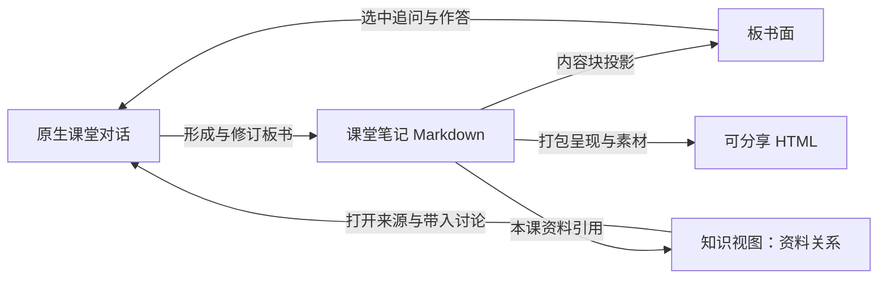

# AI 教学见解与双面课堂白板：讨论记录

日期：2026-09-24。

状态：记录用户在本轮对话中确认的产品方向、关键澄清和落地边界；未实施，不代表教学质量或白板功能已经通过验证。本轮不修改教学提示词、运行时、前端原型或真实学习数据。

相关调研：[HyperKnow 产品调研](../research/2026-09-24-hyperknow.md)。本记录承接其后续讨论；涉及课堂和白板的含义，以这里保留的最后澄清为准。

## 1. 已确认的产品取舍

1. 借鉴 HyperKnow 的白板板书呈现和可选语音，课程质量由 Notara 自己打磨。
2. 课堂应因材施教，不按既定剧本逐项讲完。备课提供目标、材料、候选问题和教学策略，现场依据学生回应决定深入、跳过、补充或调整方向。
3. 复习提纲归入复习课备课：根据近期学习情况、当前复习队列或明确复习目标综合准备，不新增独立提纲生成器。
4. 模型和学生通过多轮互动共同形成高质量上下文。二分、多分判断、选择和小任务，可以降低学生准确描述问题的门槛。
5. 白板承载课堂中的不同思路，替代原先希望用对话分支表达的课堂探索界面；结束后可导出、分享。
6. 课堂的板书与内容状态写成 Markdown 笔记，HTML 前端按 block 投影；题目等内容支持折叠。
7. 白板的另一面是“知识视图”，其确切含义是**本课资料关系图：这节课用了哪些真实资料，这些资料之间有什么联系**。
8. 用户另有委托 Opus 制作的新前端设计稿。后续白板设计应结合这份新设计继续讨论，不在本轮覆盖或改写它。

## 2. AI 教学应当帮助学生建构什么

### 2.1 根据实际理解改变课堂

HyperKnow 的实际使用片段给出了一个需要警惕的行为模式：学生提出超出入门问题的解释或反驳，老师肯定、压缩成板书，随后继续下一个知识点。肯定语变化与教学路径变化是两件事。

教师需要从学生回应中重新判断：哪些基础已经不必重复；当前解释缺少哪一环；什么问题值得停下来；何时应加深、换表示、补先修或调整原本方向。学生比预设材料走得更远时，课堂也应当跟上。

遇到反驳，教师应独立检验双方说法，区分事实、解释与假设，不以赞美替代判断。即使学生表达流畅、结构完整，也不能自动将其观点写成已证实结论。教师不了解某个细节时，可以查证、分析证据或明确保留疑问。

这段使用记录支持对该次教学行为的观察；不能据此确认 HyperKnow 内部采用固定 lesson graph，也不能推断其所有课程质量。完整私密课堂记录不复制进仓库。

### 2.2 以历史为代表的文科

用户强调思想碰撞、追问、穿针引线，以及知识之间的联系和建构。

- 从具体史实和学生已有观点中提出值得研究的问题。
- 联系时间、地域、制度、经济与社会条件，讨论解释怎样成立。
- 比较不同解释、证据和反例，检查因果链是否跳跃或压缩过头。
- 从具体案例形成可迁移的理解，同时保留各案例的差异和适用边界。

例如从货币和运输的具体问题转向“远距离交换与供给的成本”，可以形成跨材料的研究线索。这个线索仍需逐项核验，不能因为一个宏观框架有吸引力，就把不同制度解释成同一回事。本例说明教学组织方式，不作为历史事实核验结果。

### 2.3 理科

用户强调讲证据、培养直觉、抓共性，发现表面现象与内部结构之间的联系，逐步建构知识体系。

- 通过预测、图像、特殊情况和极端情形发展直觉，再用证明或实验校正。
- 识别不同题面中的共同结构、不变量、约束关系或方法，也识别表面相似但关键条件不同的题目。
- 打通语言、公式、图像和几何等表示，理解转换的依据及各自揭示的信息。
- 数学落实到定义、推理与证明；自然科学同时关注观测、实验、模型假设和适用范围。
- 以新的问题检验联系是否真正可用，不能只看学生能否复述老师的解释。

这是教学着力点的区别，不是文理科的硬性二分；历史同样需要证据，理科同样需要猜想、争论和解释比较。

## 3. 模型与学生共同填充上下文

### 3.1 初学者的启动困难

有经验的学习者能提出问题、指出矛盾、补充背景，为模型提供丰富上下文。初学者可能还不能识别自己卡在哪里，也缺少表达所需的概念。系统不能要求学生先准确诊断自己，才能开始得到帮助。

上下文质量包含两方面：学科材料应准确；对学生思考的记录应真实。错误答案、不完整尝试和说不清的疑惑，仍然可以是高价值的学习证据。问题在于怎样从这些反应中获得可靠线索。

### 3.2 通过互动形成判断

工作方式是：形成几种可能解释 → 给出一个能区分它们的小判断或任务 → 观察真实反应 → 修正判断 → 提供适当帮助并继续观察。

可用形式包括二分或多分选择、指认图中位置、比较案例、排列顺序、补一步和简短作答。模型选择最能帮助理解当前困难的任务，不强求用户写出完整的专业描述。

例如学生说“看不懂函数图像”，老师可以用位置高低与变化快慢不同的图，让学生比较并说明依据，再换一个条件检查自己的猜测。学生不必先说出“我混淆了函数值与斜率”。

设计判断题时保留这些边界：

- 选项帮助区分可能理解，不预先塞入带倾向性的二元叙事。
- 保留“不确定”“选项不符合”和自由补充的入口；选择题不垄断表达方式。
- 一次选择提供线索，不足以确定稳定能力或误区；必要时换例子、条件或追问依据。
- 任务本身可以同时承担教学；学生无法参与时，先给短例子或必要说明，再继续判断。
- 不把大套前置测评设为开课门槛，也不把所有学生分进互斥、固定的认知类别。
- 保留观察与推断的区别；新证据不支持原判断时及时修正。受到提示不自动表示失败。

学生逐渐学会识别问题、组织证据和提出更好的问题，本身就是教学成果。上下文不能仅仅越积越长，而应逐渐变得相关、准确、可修正。

## 4. 白板的两面

### 4.1 板书面：课堂实际展开的内容

板书面呈现当前问题、必要材料、题目、公式、图解、推导、学生尝试、不同解释、修订后的认识和待解决问题。它随课堂互动逐渐形成，不在开课前固定成必须逐项走完的内容。

- 主问题保持可见，临时追问和不同思路可以局部展开。
- 解法或解释可并排比较，讨论过的内容可以折叠并保留入口。
- 题面、学生尝试、提示与参考解释可分别展开，避免过早展示答案。
- 纠错时修改对应内容，必要时保留简洁的认识变化说明；不能只追加一个新结论而留下误导性的旧表述。
- 内容有清楚层级，文字、图解、圈画和高亮各有用途。借鉴 HyperKnow 的空间组织和视觉节制，具体美术与布局结合另一个分支的新设计稿确定。

这承接原“对话分支”的课堂探索需求。原生 fork 用于真正隔离消息历史，与白板中的思路分支不同；本轮不要求删除或重写原生 fork。

### 4.2 知识视图：本课实际资料及其联系

**用户最后澄清：知识视图不是抽象概念、认知模型或学生思维状态的另一张图。它是类似知识图谱的本课资料关系视图。**

节点以实际资料为对象，例如教材 PDF、讲义、题卡、变式题、已有笔记和本课形成的课堂笔记。图中说明本课用了什么，以及这些资料怎样关联。

关系示例：

- 原教材或讲义 → 从中提取的题卡，保留原文页码或区域定位。
- 原题 → 改编题或变式题，说明实际来源与变化关系。
- 资料 A ↔ 资料 B，本课用它们作比较、印证或讨论冲突，关系有具体依据。
- 课堂笔记 → 本课引用的材料、题目和已有笔记。

节点可打开真实资料、定位原文，也可回到板书中使用它的位置。板书面和资料关系面共享资料引用；同一资料不因展示在两面而复制成两个内容对象。已有资料关系可复用为本课范围的投影。

教学中可以讨论概念、方法和深层结构；这不改变知识视图节点是实际资料的定义。不要再次把这个视图扩成全新的抽象概念网络、认知状态图或学生画像系统。

## 5. Markdown 内容与 HTML 投影

用户提出的方向是：把课堂内容状态写成一份 Markdown 笔记，HTML 前端按 block 呈现，支持折叠、局部更新、课后导出和分享。

落实时的边界：

- Markdown 是课堂笔记内容的持久来源，HTML 是可重建的呈现；不同时维护可独立写入的 Markdown 正文和 HTML 正文。
- 原始消息、运行状态、权限、语音连接等仍由原生会话管理。这里的“课堂状态”指板书和内容状态，不要求把整个运行时搬进 Markdown。
- 题卡及其评估、复习排期继续归已有对象，课堂笔记通过引用关联，不生成第二份复习账本。保存板书、浏览资料和课堂结束都不自动成为掌握证据。
- 内容块需要能稳定定位，以支持选中追问、局部更新和资料回跳；身份、版本和绑定由系统维护。具体锚点语法、分块规则及写入接口尚未确定。
- 前端负责分列、排版、强调、折叠和焦点等呈现。是否允许自由拖拽、如何保存布局，不在本轮提前定成复杂画布格式。
- 笔记可在课堂中持续形成，结束时整理；不把“结束课堂”设为唯一保存时机。

### 导出与分享

课后可以导出 Markdown 或由同一内容生成可独立阅读的 HTML。HTML 保留必要的公式、图示、样式和折叠交互，资料引用应说明出处；具体素材打包和链接处理需要实现时验证。

折叠只控制显示，不承担保密。分享范围、学生作答是否包含、参考答案是否发布需要有明确选择；教师专属内容在不应分享时必须从导出内容中排除。导出文件的本地阅读交互与应用内继续 AI 对话是不同能力，不默认离线 HTML 具有模型服务。

### 可选语音

语音作为同一课堂的可选输入输出，文字仍可独立使用。语音、板书和对话应服务同一学习过程，不形成新课堂生命周期。具体服务、时序同步、打断和音频导出未在本轮选定。

## 6. 后续需要验证的行为

以下是验证方向，尚未执行：

- 初学者无需先准确描述困难，也能通过小判断、观察和尝试进入有效学习。
- 学生已理解基础或提出反驳时，老师实际调整问题和路径，并独立核验双方解释。
- 板书围绕真实互动形成；修订、刷新和重开后不丢内容，不与课堂记录冲突。
- 知识视图呈现本课真实资料及可解释的联系，能回到正确原文和板书位置。
- 同一内容的两种视图与导出结果一致；折叠、公式和素材在导出后仍可用。
- 语音启停、打断和文字衔接有独立的交互证据。

外观原型、确定性测试和真实教学效果分别验收，不能相互替代。

## 7. 另一个分支的新前端设计稿

用户说明这份设计由其委托 Opus 制作。本轮已在本机核对到以下文件，未修改它们：

- 工作树：`/Users/yangrundong/DSH-frontend-design`。
- 分支：`design/notara-frontend`；HEAD：`5a5886f`，基线 Native Vault 0.14.9。
- [设计说明](/Users/yangrundong/DSH-frontend-design/docs/ui/notara-frontend-redesign.md)，标题为“Notara 前端重设计（基于 Native Vault 0.14.9）”。
- [可交互原型](/Users/yangrundong/DSH-frontend-design/docs/ui/notara-frontend-prototype.html)，默认现代简约主题，另有手写手帐主题。
- [设计交接记录](/Users/yangrundong/DSH-frontend-design/docs/dev-log/2026-09-24-frontend-redesign.md)。

查验时设计说明、HTML 原型、交接记录和 `docs/evidence/frontend-redesign/` 均为该工作树的未跟踪文件，尚未进入分支提交。不能只用 `git show design/notara-frontend:...` 或仅切换分支来查找这些产物；接续时应先检查上述工作树，保留原文件和用户改动。

已核对的设计方向：

- 全局结构为“今日／资料库／计划／课堂”，资料库整合文件、卡片、图谱，计划整合路线、日历、复习。
- 设计说明“设计原则”与“4.2 课堂”采用对话主区加右侧资料伴随面板，保留单个原生输入框。
- “4.4 资料库”已有来源、上级、拆出、被引用等资料关系的展示方向。
- 本轮未找到双面白板、可选语音或课堂 Markdown 按 block 投影的完整设计。

**需要整合的具体点**：现有稿将课堂主区固定为对话，新讨论增加板书面与本课资料关系面。后续应在新稿既有全局结构、主题与原生会话边界上调整课堂部分，并明确本课资料图与全局资料库图谱的范围区别；具体布局、切换和小屏行为尚未决定。本记录不把旧稿的固定对话布局当作白板的已定方案，也不擅自重做原型。

已有交接记录报告过原型浏览器验证 143/143 和 28 张截图。本轮仅阅读其记录，未复跑；它是旧原型的历史证据，不是新增白板、真实运行时或教学质量通过。

## 8. 记录位置与接续入口

本记录保存在 `/Users/yangrundong/DSH` 的 `main@f84a29b` 工作树。当前主仓与 Native Vault 及设计工作树有差异，本文的产品方向不能视为任一版本已经实现。

后续讨论入口是本记录“4. 白板的两面”和新前端设计说明“4.2 课堂”；实现前再核对 Native Vault 中的真实接线。尚未选定的 block 合同、布局、图谱筛选、导出和语音细节应在对应实现范围内明确，不从本文推导已经批准完整重构。
